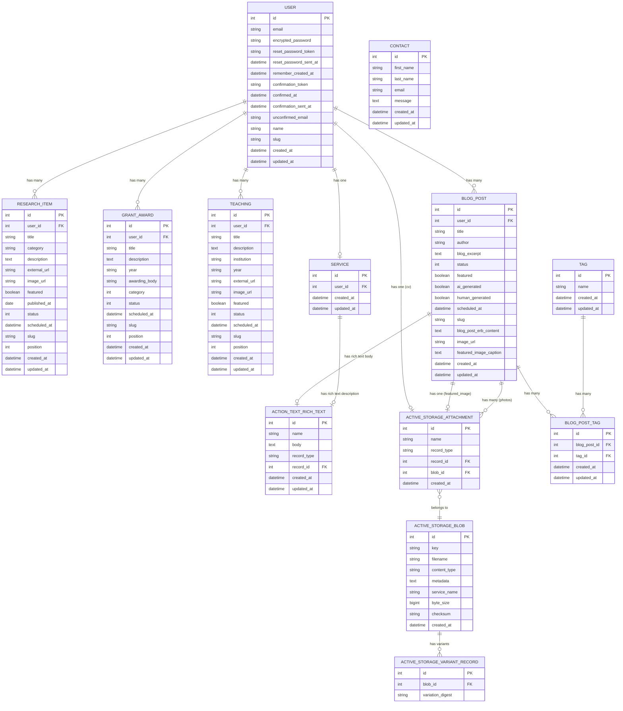

# isarak-portfolio — Entity Relationship Diagram

## Notes

- All owned resources (`ResearchItem`, `GrantAward`, `Teaching`, `BlogPost`, `Service`) have a `user_id` FK — each belongs to User (Isara)
- `category` is a Rails enum:
  - `ResearchItem`: string-backed — 10 categories: `journal_article / edited_book / book / book_chapter / thesis / conference_paper / white_paper / conference_presentation / article / project`
  - `GrantAward`: integer-backed — `grant (0) / award (1)`
- `BlogPost.status` enum: `draft / scheduled / published`
- `ResearchItem.status` enum: `draft (0) / scheduled (1) / published (2)` — same pattern as BlogPost; visitors only see published items; `scheduled_at` holds the auto-publish time
- `Teaching.status` enum: `draft (0) / scheduled (1) / published (2)` — same pattern; public show page exists; visitors only see published items
- `GrantAward.status` enum: `draft (0) / scheduled (1) / published (2)` — same pattern; no public show page (index is admin-only); status controls homepage visibility
- `BlogPost.body` — Action Text rich text (Trix editor). Stored in `action_text_rich_texts`, not in `blog_posts` table directly
- `BlogPost.blog_post_erb_content` — plain text column for AI-generated HTML/ERB content
- `BlogPost.blog_excerpt` — plain text short summary shown on index cards
- `BlogPost.featured` — flags posts for display on the homepage blog section
- `BlogPost.featured_image` — Active Storage `has_one_attached`; auto-set from Unsplash on AI posts
- `BlogPost.image_url` — plain string fallback; shown only when `featured_image` is not attached; passed through `ai_params` and saved by `BlogPostAiService`
- `BlogPost.featured_image_caption` — plain text column storing `<figcaption>` HTML for Unsplash photographer attribution; set by `BlogPostAiService` when an Unsplash URL is fetched; rendered with `raw` under the featured image on the show page; nil for uploaded images
- `BlogPost.photos` — Active Storage `has_many_attached`; available for manual uploads
- `BlogPost.human_generated` — boolean flag (default false); mirrors `ai_generated` for filtering
- `Service.description` — Action Text rich text stored in `action_text_rich_texts`; single record per user
- `GrantAward.featured` — REMOVED; all awards appear on homepage ordered by `position`; drag order on index = homepage order
- `Teaching.featured` — flags teachings for display on the homepage Teaching spotlight (max 3, ordered by `updated_at: :desc`)
- `ResearchItem.featured` — flags items for homepage Research section (max 4, ordered by `updated_at: :desc`)
- `position` (int) — on Teaching, ResearchItem, GrantAward; controls drag-and-drop display order on index pages only (does not affect homepage for Teaching/Research)
- `Teaching.external_url` — optional string; shown as a "More Information" link on the public show page; input in the edit form
- `ResearchItem.external_url` — optional string; shown as a "More Information" link on the public show page (was "View full paper" — renamed for consistency)
- `User.cv` — Active Storage `has_one_attached`; stored in Cloudinary via Active Storage
- `User.name` — display name (e.g. "Dr Isara Khanjanasthiti")
- `User.slug` — FriendlyId slug (based on email); used for readable URLs
- `Contact` — standalone model; no FK to User; stores contact form submissions only
- Active Storage uses Cloudinary as the backend in both development and production (`config.active_storage.service = :cloudinary`)
- `active_storage_variant_records` stores Cloudinary transformation references (not local files)
- `Tag.name` — unique case-insensitively; `before_save` normalises capitalisation using `\b[a-z]` regex (preserves hyphens, unlike `titleize`)
- `BlogPostTag` — join table; unique composite index on `[blog_post_id, tag_id]`; `has_many :through` from both sides
- Mermaid can't model polymorphic associations precisely — `ACTIVE_STORAGE_ATTACHMENT.record_type` holds the owner class name (`"User"`, `"BlogPost"`, `"Service"`, etc.) and `record_id` holds the owner's PK
