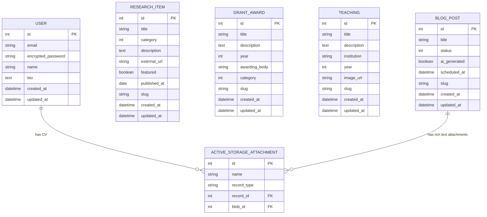

# isarak-portfolio — Entity Relationship Diagram

## Notes

- No `user_id` FK on resources — Isara is the only user, resources are managed content not owned records
- `category` is a Rails enum (stored as `int`, mapped to labels)
  - `ResearchItem`: `project / paper / publication`
  - `GrantAward`: `grant / award`
- `BlogPost.status` enum: `draft / scheduled / published`
- `ActionText` rich text body (blog posts) lives in `action_text_rich_texts` — managed by Rails automatically
- CV attachment on `User` handled by Active Storage
