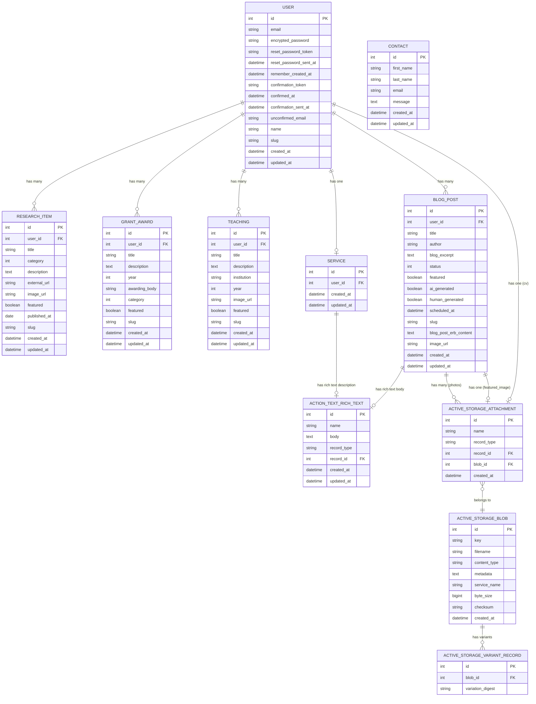

# isarak-portfolio — Entity Relationship Diagram

## Notes

- All owned resources (`ResearchItem`, `GrantAward`, `Teaching`, `BlogPost`, `Service`) have a `user_id` FK — each belongs to User (Isara)
- `category` is a Rails enum (stored as `int`, mapped to labels):
  - `ResearchItem`: `project / paper / publication`
  - `GrantAward`: `grant / award`
- `BlogPost.status` enum: `draft / scheduled / published`
- `BlogPost.body` — Action Text rich text (Trix editor). Stored in `action_text_rich_texts`, not in `blog_posts` table directly
- `BlogPost.blog_post_erb_content` — plain text column for AI-generated HTML/ERB content
- `BlogPost.blog_excerpt` — plain text short summary shown on index cards
- `BlogPost.featured` — flags posts for display on the homepage blog section
- `BlogPost.featured_image` — Active Storage `has_one_attached`; auto-set from Unsplash on AI posts
- `BlogPost.image_url` — plain string fallback; shown only when `featured_image` is not attached; passed through `ai_params` and saved by `BlogPostAiService`
- `BlogPost.photos` — Active Storage `has_many_attached`; available for manual uploads
- `BlogPost.human_generated` — boolean flag (default false); mirrors `ai_generated` for filtering
- `Service.description` — Action Text rich text stored in `action_text_rich_texts`; single record per user
- `GrantAward.featured` — flags awards for display on the homepage Awards slider
- `Teaching.featured` — flags teachings for display on the homepage Teaching spotlight
- `User.cv` — Active Storage `has_one_attached`; stored in Cloudinary via Active Storage
- `User.name` — display name (e.g. "Dr Isara Khanjanasthiti")
- `User.slug` — FriendlyId slug (based on email); used for readable URLs
- `Contact` — standalone model; no FK to User; stores contact form submissions only
- Active Storage uses Cloudinary as the backend in both development and production (`config.active_storage.service = :cloudinary`)
- `active_storage_variant_records` stores Cloudinary transformation references (not local files)
- Mermaid can't model polymorphic associations precisely — `ACTIVE_STORAGE_ATTACHMENT.record_type` holds the owner class name (`"User"`, `"BlogPost"`, `"Service"`, etc.) and `record_id` holds the owner's PK
